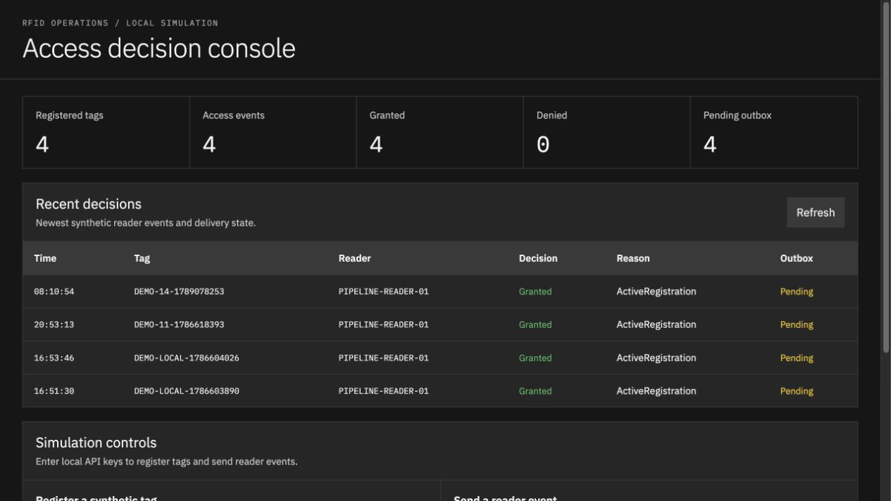

# RFID Operations Console

A .NET 10 application for registering RFID tags, processing access requests and reviewing decisions in a web console. Active registered tags are granted access; unknown or inactive tags are denied. SQLite stores each decision and queues an outbox entry for downstream delivery.

This project was built for SIT223 7.3HD to exercise a seven-stage Jenkins pipeline. It uses simulated reader events and separate local staging and production-like containers. No physical RFID reader is connected.

[Watch the demonstration (7:20)](https://drive.google.com/file/d/1IiOHtabuf0zDHN0I_kxpE-9BG_8kJgIL/view?usp=drivesdk) · [Jenkinsfile](Jenkinsfile) · [Build results](docs/evidence/README.md)



## Pipeline

Jenkins build 14 completed in 3 minutes 15 seconds on 11 September 2026. It built and released image `rfid-ops:1.0.14-a1152b5` from source revision `a1152b5`.

| Stage | What it does | Build 14 result |
| --- | --- | --- |
| Build | Builds a multi-stage Docker image and records its version and image ID | Version and image ID recorded |
| Test | Runs xUnit unit, SQLite persistence and HTTP API tests | 18 passed, 0 failed, 0 skipped |
| Code Quality | Checks formatting and runs SonarQube analysis | Gate passed; 77.0% coverage, 0.0% duplication, 0 new issues |
| Security | Runs NuGet audit and Trivy filesystem and image scans | No findings in the configured high/critical result sets |
| Deploy | Starts the staging container and checks health, metrics and an access request | Healthy; request granted |
| Release | Promotes the same image to the production-like environment | Promotion and smoke tests passed |
| Monitoring | Stops the released app, checks the outage alert, then restarts it | Local firing and resolved alerts received; target recovered |

The [build results](docs/evidence/README.md) include logs, test reports, scan output and screenshots. This repository is a publication snapshot; the [source record](docs/PROVENANCE.md) connects its files to the revision used by build 14.

## Run locally

Install the .NET 10 SDK specified in [global.json](global.json) and Docker Desktop, then clone the repository:

```bash
git clone https://github.com/stefan-mcf/rfid-operations-console-devsecops-lab.git
cd rfid-operations-console-devsecops-lab
cp .env.example .env
```

Replace the reader and administrator keys in `.env` with two different random values. Load the environment and run the tests and application:

```bash
set -a
source .env
set +a

dotnet restore RfidOperationsConsole.slnx
dotnet test RfidOperationsConsole.slnx
docker build -t "$RFID_OPS_IMAGE" .
docker compose -f deploy/compose.staging.yml up -d
```

Open <http://localhost:18080>. Use the administrator key to register a tag, then the reader key to send an event. The console shows the decision and outbox status. `.env.example` sets `RFID_OPS_IMAGE=rfid-ops:local`; keep that value or choose your own local image tag.

Stop the application with `docker compose -f deploy/compose.staging.yml down`. The named SQLite volume is retained.

For the complete pipeline, follow the [Jenkins and SonarQube setup](infra/jenkins/README.md).

## API

| Route | Purpose | Key |
| --- | --- | --- |
| `GET /health` | Application health and SQLite reachability | None |
| `GET /metrics` | Prometheus metrics | None |
| `GET /api/v1/status` | Tag, event and outbox counts | None |
| `GET /api/v1/events` | Recent access decisions | None |
| `PUT /api/v1/tags/{tagId}` | Register or update a tag | `X-Admin-Key` |
| `POST /api/v1/events` | Process a reader event | `X-Reader-Key` |
| `POST /api/v1/outbox/{eventId}/acknowledge` | Acknowledge downstream delivery | `X-Admin-Key` |

## Project structure

- `src/RfidOps.Core`: access rules and domain types.
- `src/RfidOps.Api`: HTTP routes, SQLite storage and web console.
- `tests/RfidOps.Tests`: unit, persistence and API tests.
- `scripts/ci`: scripts called by the Jenkinsfile.
- `deploy`: staging and production-like Docker Compose configurations.
- `monitoring`: Prometheus, Alertmanager, Grafana and a local alert receiver.
- `infra/jenkins`: Jenkins controller image and Configuration as Code.

## Limitations

SonarQube excludes the browser files in `wwwroot` from analysis and coverage. The gate requires at least 70% coverage, no more than 3% duplication, zero new issues and zero blocker issues. One minor Dockerfile maintainability issue remains.

Trivy checks high and critical findings; a passing result does not cover every severity. The [security findings](docs/evidence/security-findings.md) explain the SQLite dependency and container-user issues addressed during development.

Release rollback is implemented but was not exercised in build 14. Monitoring sends alerts to a local receiver, with no email, SMS or chat integration. The outbox supports acknowledgement, but no external delivery adapter is connected.
